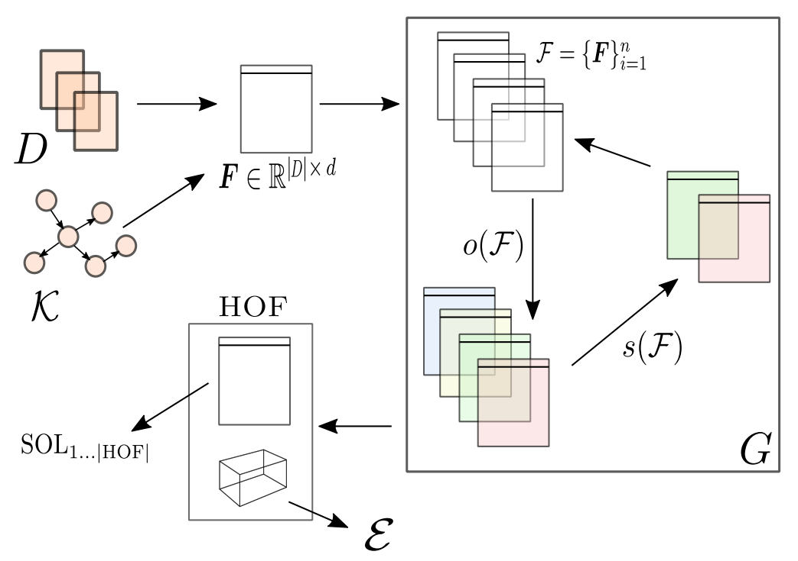

Key idea underlying autoBOTLib
===============

Learning from texts has been widely adopted throughout industry and science. 
While state-of-the-art neural language models have shown very promising results for text classification, they are expensive to (pre-)train, require large amounts of data, and require tuning of hundreds of millions or more parameters.
This paper explores how automatically evolved text representations can serve as a basis for explainable, low-resource branch of models with competitive performance that are subject to automated hyperparameter tuning. We present autoBOTLib (automatic Bags-Of-Tokens), an autoML approach suitable for low resource learning scenarios, where both the hardware and the amount of data required for training are limited. The proposed approach consists of an evolutionary algorithm that jointly optimizes various sparse representations of a given text (including word, subword, POS tag, keyword-based, knowledge graph-based and relational features) and two types of document embeddings (non-sparse representations).
The key idea of autoBOTLib is that, instead of evolving on the learner level, evolution is conducted at the representation level. The proposed method offers competitive classification performance on fourteen real-world classification tasks when compared against a competitive autoML approach that evolves ensemble models, as well as state-of-the-art neural language models such as BERT and RoBERTa. Moreover, the approach is explainable, as the importance of the parts of the input space is part of the final solution yielded by the proposed optimization procedure, offering potential for meta-transfer learning.

TLDR:

.. code:: python3

    import autoBOTLib
    import pandas as pd
	
    ## Load example data frame - step 1
    dataframe = pd.read_csv("../data/insults/train.tsv", sep="\t")
    train_sequences = dataframe['text_a']
    train_targets = dataframe['label']

    ## Run evolution - step 2
    autoBOTLibObj = autoBOTLib.GAlearner(train_sequences, train_targets, time_constraint = 1).evolve()

    ## Inspect or make predictions - step 3
    dataframe2 = pd.read_csv("../data/insults/test.tsv", sep="\t")
    test_sequences = dataframe2['text_a']
    predictions = autoBOTLibObj.predict(test_sequences)

    ## Generate a training report with importances (and other metrics)
    autoBOTLibObj.generate_report(output_folder = "./")
